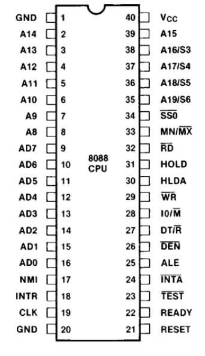
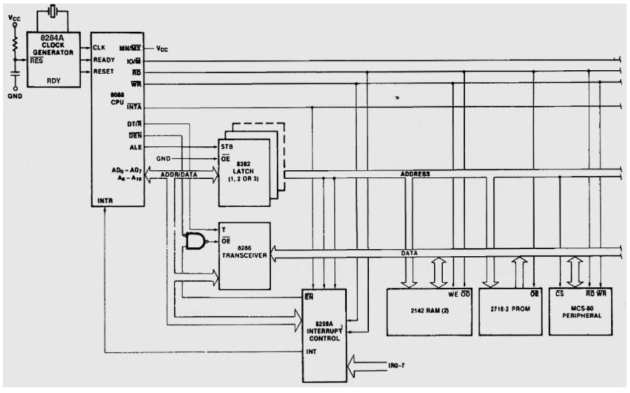
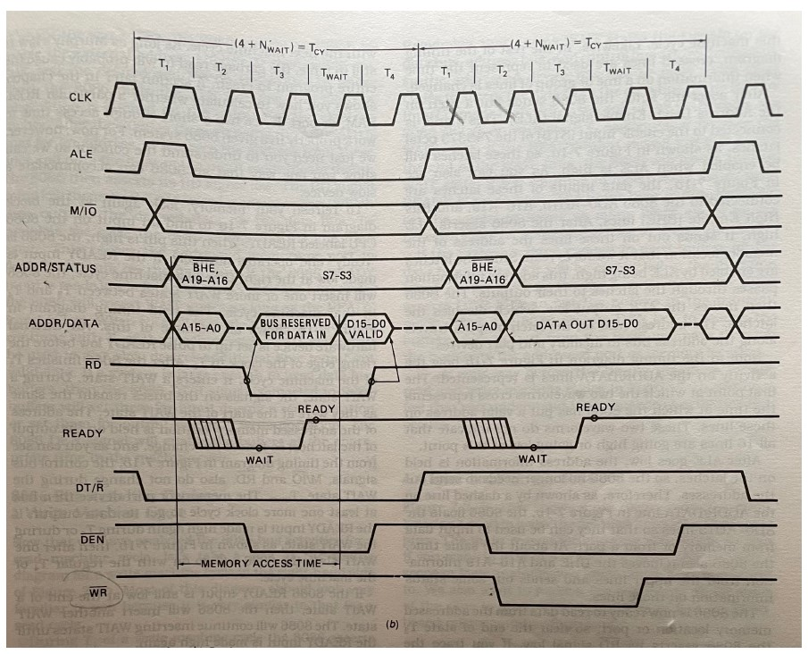
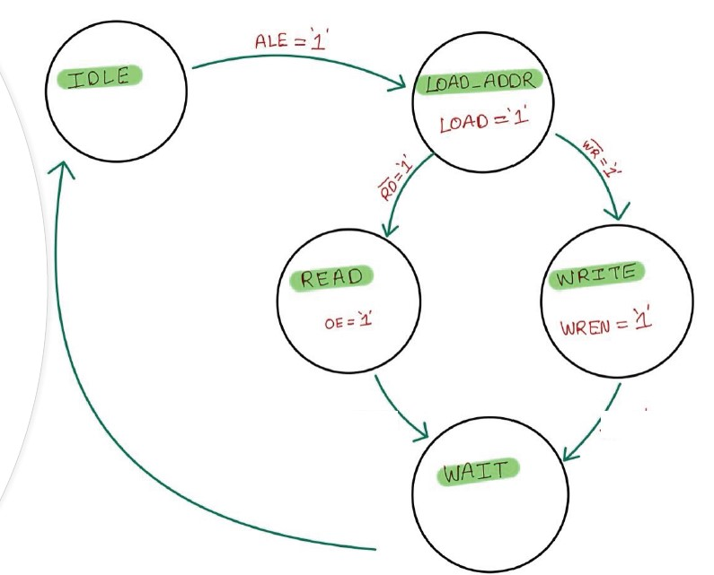
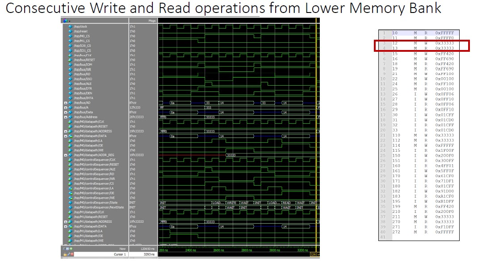
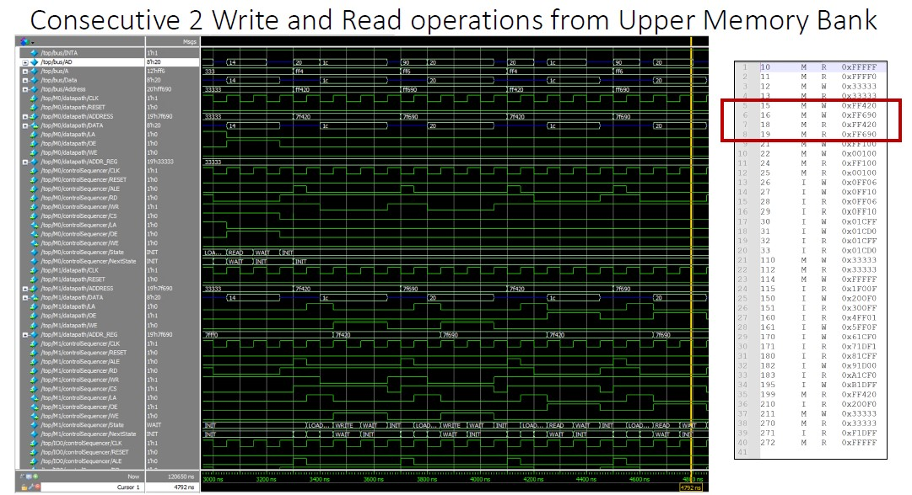
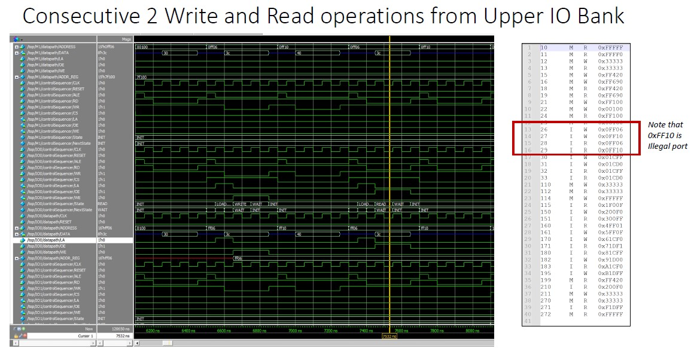
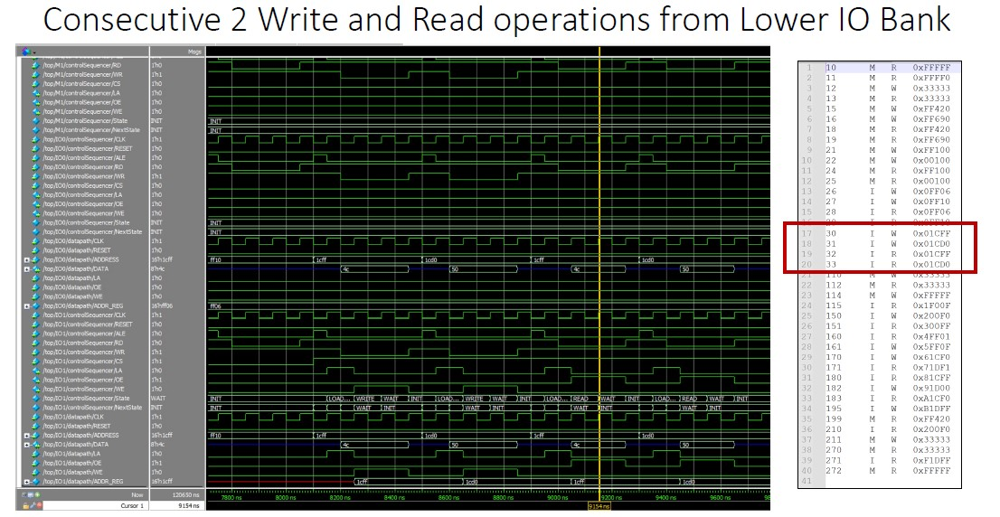

# Intel 8088 Interface Simulation

The project for the "Introduction to SystemVerilog" course is centered around gaining a comprehensive understanding of the Intel 8088 microprocessor, including how it interfaces with memory and I/O peripherals. The practical component of the course involves modeling these interactions using SystemVerilog, with a focus on the ‘memorio‘ module, which emulates memory or I/O modules that communicate with the Intel 8088 bus. This project is not only an exercise in SystemVerilog programming but also an exploration into the inner workings of a fundamental piece of computing history.

Understanding the Intel 8088’s operation and its interfacing with memory and I/O peripherals is pivotal for grasping the foundational concepts of microprocessor functionality. Through this project, we will learn how data flows between the processor and various peripheral devices, which is crucial
for both historical knowledge and modern computing applications. The significance of the project lies in its ability to bridge the gap between
theoretical knowledge and practical skillset, as we model these interactions using the powerful SystemVerilog language.

This project simulates an Intel 8088 interface with memory and I/O modules using SystemVerilog. The simulation includes both Moore and Mealy FSM variants of the memory/I/O module. This project involves system-level design and integration, creation and use of SystemVerilog interfaces, $readmemh, bus-functional models, FSM modeling, and using protected SystemVerilog IP.

## Implementation

The implementation of the project is two-fold. Firstly, the ‘memorio‘ SystemVerilog module is designed as a 5-state Moore FSM, comprising the
Datapath and ControlSequencer sub-modules. The Datapath is responsible for data storage and retrieval, while the ControlSequencer manages operation timing and
control signal generation. The module operates with parameterization for customization and includes a tristate buffer for bidirectional data bus control.
Secondly, the ‘top‘ module functions as a testbench, generating chip select signals to interface the Intel 8088 processor with memory and I/O modules. It
includes logic to determine active modules based on the current address and operation mode, as well as hardware elements like an 8282 latch and an 8286
transceiver to manage bus signals. Additionally, a self-checking testbench named ‘memorio_tb‘ is implemented to verify the correct operation of the‘MemoryOrIOModule‘ module. This testbench includes write and read tasks to interact with memory and I/O modules, and it concludes with a pass or fail message based on an error flag, ensuring thorough validation of the module’s functionality. The report includes black box diagrams, state transition diagrams, and detailed code snippets to illustrate the design and operation of the ‘memorio‘ module, as well as the ‘top‘ module and simulation results.

## Intel 8088 Pinout



## Intel 8088 with Peripherals



## Intel 8088 Bus Operations



## Prerequisites

Ensure you have the following files in the project directory:
1. `interface.sv`
2. `memorio.sv` (Moore FSM Memory/IO module)
3. `top_interface.sv` (Top-level module)
4. `busops.txt` (Bus operations for the Intel 8088 Interface module)
5. `run.do` (Simulation commands)
6. Memory initialization files generated by `memfilegenerator.py`
7. Encrypted Intel 8088 Interface module
8. `memorio_mealy.sv` (Mealy FSM Memory/IO module)
9. `memorio_tb.sv` (Self-checking testbench for the Moore FSM Memory/IO module)

## Generating Memory Initialization Files

Use the `memfilegenerator.py` script to generate memory initialization files:
```python
python memfilegenerator.py
```

## Running the Simulation

1. Ensure all required files are in the project directory.
2. Use your preferred SystemVerilog simulator to run the `run.do` script.

## File Descriptions

- **interface.sv**: Defines the interface for the Intel 8088.
- **memorio.sv**: Moore FSM-based memory/I/O module.
- **top_interface.sv**: Top-level module that instantiates the memory/I/O module and the Intel 8088.
- **busops.txt**: Contains bus operations for the Intel 8088 interface module.
- **run.do**: Contains simulation commands.
- **memfilegenerator.py**: Python script to generate memory initialization files.
- **memorio_mealy.sv**: Mealy FSM-based memory/I/O module (extra credit).
- **memorio_tb.sv**: Self-checking testbench for the Moore FSM memory/I/O module (extra credit).

## FSM Design

### Moore FSM


## Waveforms

### Lower Memory Write/Read Operations


### Upper Memory Write/Read Operations


### Upper I/O Write/Read Operations


### Lower I/O Write/Read Operations


