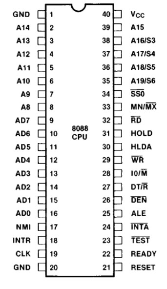
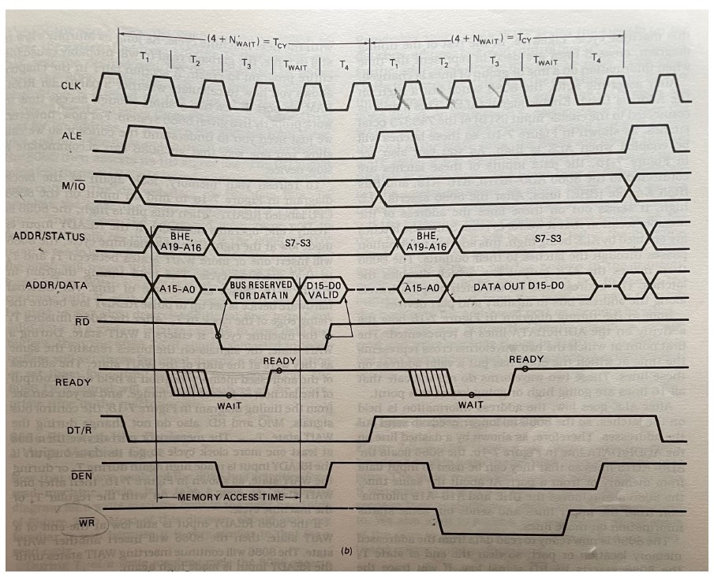
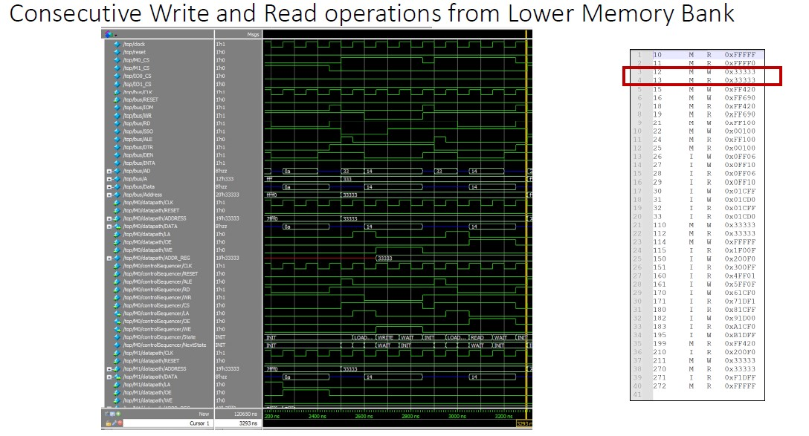
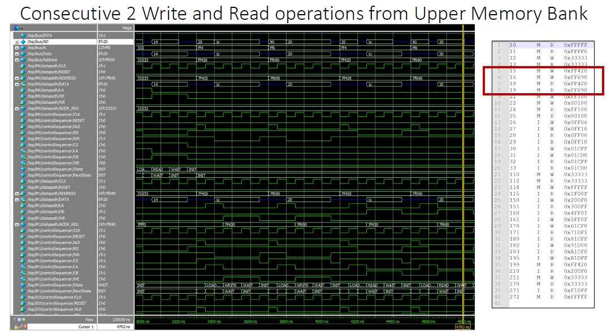
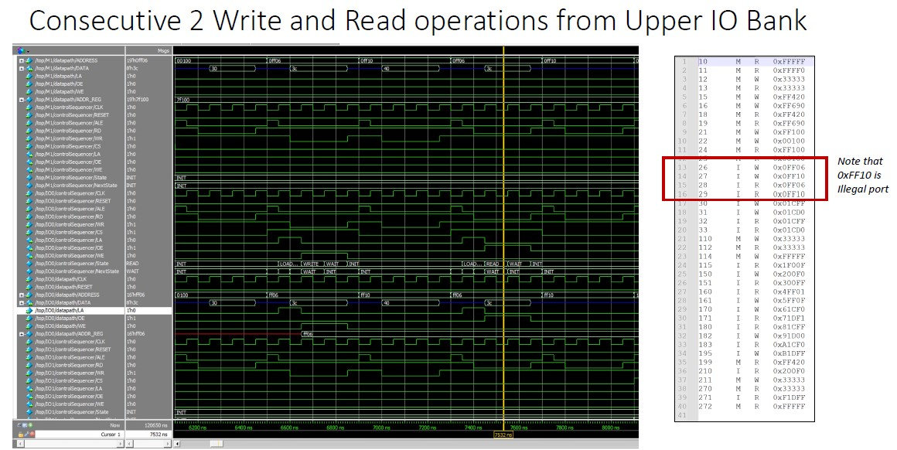
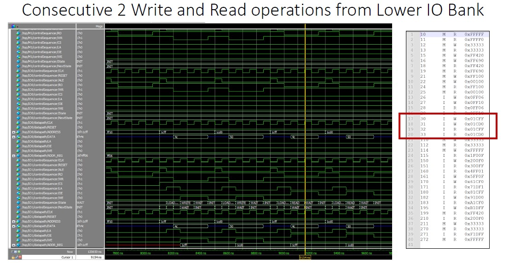

# Intel 8088 Interface Simulation

The project for the "Introduction to SystemVerilog" course is centered around gaining a comprehensive understanding of the Intel 8088 microprocessor, including how it interfaces with memory and I/O peripherals. The practical component of the course involves modeling these interactions using SystemVerilog, with a focus on the `memorio` module, which emulates memory or I/O modules that communicate with the Intel 8088 bus. This project is not only an exercise in SystemVerilog programming but also an exploration into the inner workings of a fundamental piece of computing history.

Understanding the Intel 8088's operation and its interfacing with memory and I/O peripherals is pivotal for grasping the foundational concepts of microprocessor functionality. Through this project, we will learn how data flows between the processor and various peripheral devices, which is crucial for both historical knowledge and modern computing applications. The significance of the project lies in its ability to bridge the gap between theoretical knowledge and practical skillset, as we model these interactions using the powerful SystemVerilog language.

This project simulates an Intel 8088 interface with memory and I/O modules using SystemVerilog. The simulation includes both Moore and Mealy FSM variants of the memory/I/O module. This project involves system-level design and integration, creation and use of SystemVerilog interfaces, `$readmemh`, bus-functional models, FSM modeling, and using protected SystemVerilog IP.

## Repository Layout

```
.
├── rtl/                       Synthesizable design
│   ├── interface.sv           Intel8088Pins interface + Processor/Peripheral modports
│   ├── memorio.sv             Moore FSM memory/IO module (5 states)
│   └── memorio_mealy.sv       Mealy FSM memory/IO module (3 states, extra credit)
├── tb/                        Testbenches
│   ├── top_interface.sv       Top instantiating the encrypted 8088 + four MemoryOrIOModules
│   └── memorio_tb.sv          Self-checking testbench (extra credit)
├── ip/
│   └── 8088if.svp             Encrypted Intel 8088 processor model (QuestaSim IP)
├── stimulus/
│   └── busops.txt             Bus-op trace consumed by the encrypted IP
├── scripts/
│   ├── run.do                 QuestaSim run script (the entry point)
│   └── memfilegenerator.py    Generates the four .mem init files into sim/
├── docs/
│   ├── instructions.txt
│   ├── transcript_selfchecking.txt
│   └── images/                Pinout, FSM diagram, waveform captures
├── sim/                       Build directory (gitignored except .gitkeep)
│   └── (work/, *.ucdb, generated .mem, copied busops.txt land here)
├── archive/                   Historical variants — not part of any build
└── README.md
```

## Implementation

The implementation of the project is two-fold. First, the `MemoryOrIOModule` (`rtl/memorio.sv`) is designed as a 5-state Moore FSM, comprising the `Datapath` and `ControlSequencer` sub-modules. The Datapath is responsible for data storage and retrieval, while the ControlSequencer manages operation timing and control signal generation. The module operates with parameterization for customization and includes a tristate buffer for bidirectional data bus control. Second, the `top` module (`tb/top_interface.sv`) functions as a testbench, generating chip select signals to interface the Intel 8088 processor with memory and I/O modules. It includes logic to determine active modules based on the current address and operation mode, as well as hardware elements like an 8282 latch and an 8286 transceiver to manage bus signals. Additionally, a self-checking testbench (`tb/memorio_tb.sv`) verifies the correct operation of the `MemoryOrIOModule`. This testbench includes write and read tasks to interact with memory and I/O modules, and it concludes with a pass or fail message based on an error flag, ensuring thorough validation of the module's functionality.

## Intel 8088 Pinout



## Intel 8088 with Peripherals


## Intel 8088 Bus Operations



## Prerequisites

- **QuestaSim / ModelSim** (the `.do` script uses Questa-specific commands; the encrypted `ip/8088if.svp` is QuestaSim-encrypted IP and will not load in Verilator, Icarus, or VCS).
- **Python 3** for `scripts/memfilegenerator.py` (standard library only).

## Generating Memory Initialization Files

The four `.mem` files (totaling ~3.4 MB) are gitignored — generate them locally before running a simulation for the first time:

```sh
python scripts/memfilegenerator.py
```

The script writes `memory0_init.mem`, `memory1_init.mem`, `io_device0_init.mem`, and `io_device1_init.mem` into `sim/`, which is where `$readmemh` and the simulator look for them. The contents are random; re-running the generator produces different (but valid) initial state.

## Running the Simulation

From the project root:

```tcl
# Interactive (inside a vsim shell):
do scripts/run.do

# Or batch:
vsim -c -do "do scripts/run.do; quit -f" | tee sim/transcript
```

`scripts/run.do` does:

1. `catch {vdel -all}` — safe library wipe (no error on a fresh checkout).
2. `cd sim` — keep all artifacts in `sim/`.
3. `file copy -force ../stimulus/busops.txt .` — stage the bus-op trace where the encrypted 8088 IP expects to find it.
4. Compile (`vlog -source -lint`) one configuration's RTL + TB + (optionally) the 8088 IP.
5. Optimize with coverage (`vopt ... +cover=sbfec+MemoryOrIOModule(rtl).`).
6. `vsim -coverage`, `run -all`.
7. Save and report coverage (`memorio.ucdb`).

### Selecting a configuration

`scripts/run.do` contains four mutually-exclusive `vlog` lines. Uncomment exactly one:

| # | Configuration | Pass criterion |
|---|---|---|
| 1 | Moore FSM + encrypted 8088 IP (**default**) | Inspect waveforms against the timing diagram. |
| 2 | Moore FSM + self-checking testbench | Transcript ends in `*** PASSED ***`. |
| 3 | Mealy FSM + encrypted 8088 IP | Inspect waveforms. |
| 4 | Mealy FSM + self-checking testbench | Transcript ends in `*** PASSED ***`. |

## File Descriptions

- **`rtl/interface.sv`** — `Intel8088Pins` interface with `Processor` and `Peripheral` modports.
- **`rtl/memorio.sv`** — Moore FSM-based memory/IO module (`Datapath` + `ControlSequencer`).
- **`rtl/memorio_mealy.sv`** — Mealy FSM variant (extra credit, 3 states).
- **`tb/top_interface.sv`** — Top-level TB instantiating four `MemoryOrIOModule`s (2 memory, 2 I/O) plus the encrypted 8088 processor, the 8282 address latch, and the 8286 data transceiver.
- **`tb/memorio_tb.sv`** — Self-checking testbench (extra credit) that performs ~3000 writes/reads and prints `*** PASSED ***` or `*** FAILED ***`.
- **`ip/8088if.svp`** — QuestaSim-encrypted Intel 8088 processor model.
- **`stimulus/busops.txt`** — Bus-op trace `<time> <M|I> <R|W> <20-bit-hex-addr>` consumed by the encrypted IP.
- **`scripts/run.do`** — QuestaSim run script (entry point).
- **`scripts/memfilegenerator.py`** — Generates the four memory init files into `sim/`.

## FSM Design

### Moore FSM


## Waveforms

### Lower Memory Write/Read Operations


### Upper Memory Write/Read Operations


### Upper I/O Write/Read Operations


### Lower I/O Write/Read Operations

