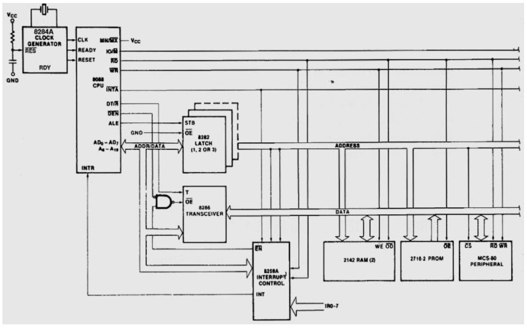
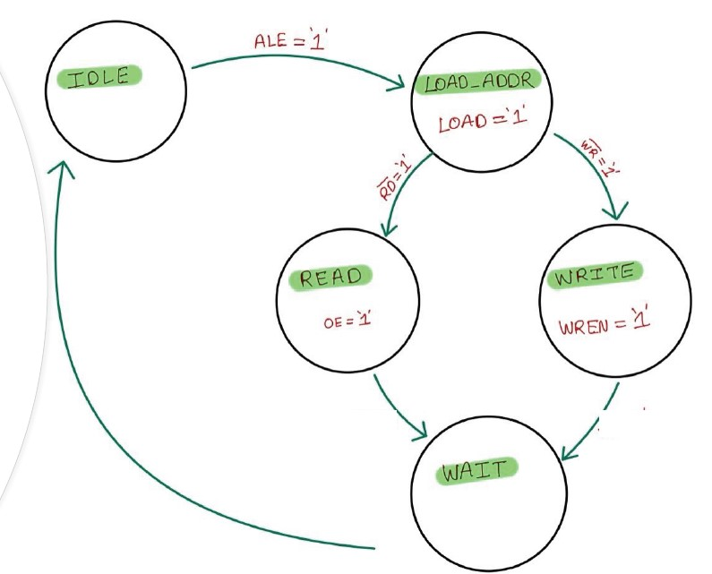
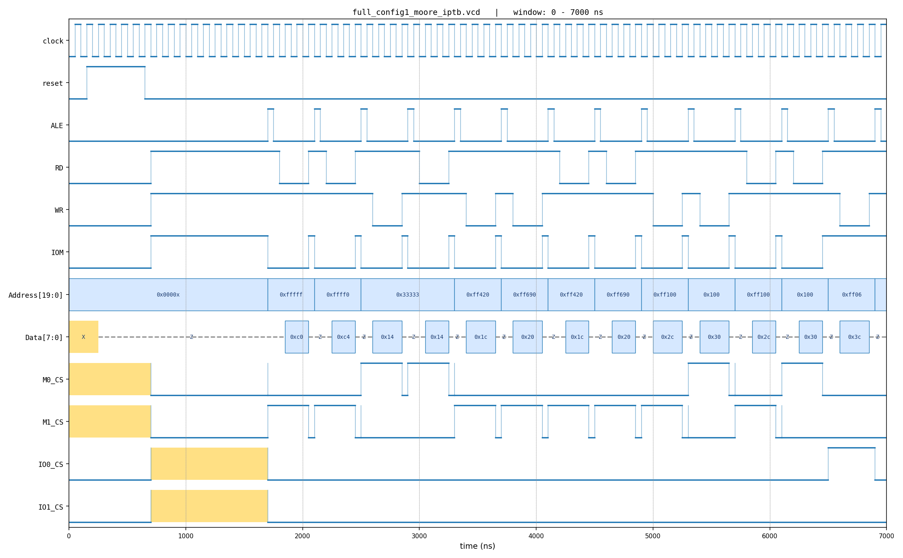

<!-- _class: lead -->

# Intel 8088 Bus-Compatible Memory & I/O

### SystemVerilog modeling of an Intel 8088 microprocessor bus interface

**Sasha Katne**
PSU ECE — Introduction to SystemVerilog
[github.com/sashakatne/8088BusCompatibleModules](https://github.com/sashakatne/8088BusCompatibleModules)

---

## The Problem

The Intel 8088 has a **multiplexed address/data bus**: a 20-bit address and an 8-bit data byte share the same physical pins.

A compatible peripheral must:

- **Latch** the lower address byte from `AD[7:0]` on the **ALE** strobe (the upper bits `A[19:8]` arrive separately)
- Distinguish **memory vs. I/O** access via the `IOM` pin
- Respond to active-low **`RD`** / **`WR`** strobes at the right phase
- **Tristate** the data bus when not driving it

This project models the **peripheral side** — two 512 KB memory banks and two I/O port ranges — as parameterized SystemVerilog modules that interoperate with an encrypted Intel 8088 reference IP.

---

## System Architecture



- **1 RTL module → 4 instances** (parameterized address width + init file)
- Chip-select decode happens in top-level wiring, not inside the module
- 8282 latch and 8286 transceiver are modeled behaviorally at the top level
- The 8088 multiplexes `AD[7:0]` (address+data); `A[19:8]` are non-multiplexed
- `IOM` chooses memory vs. I/O space; `ALE` strobes the address latch

---

## `MemoryOrIOModule` — One Module, Four Roles

```verilog
module MemoryOrIOModule (Intel8088Pins bus, input wire CS);
    parameter ADDR_WIDTH = 20;
    parameter DATA_WIDTH = 8;
    parameter INIT_FILE  = "memory_init.mem";

    Datapath          datapath (...);  // memory array + tristate
    ControlSequencer  ctrl     (...);  // FSM
endmodule
```

| Instance | Width | Address range | Init file |
|---|---|---|---|
| `M0`  | 19 bits | `0x00000 - 0x7FFFF` | `memory0_init.mem` |
| `M1`  | 19 bits | `0x80000 - 0xFFFFF` | `memory1_init.mem` |
| `IO0` | 16 bits | `0xFF00 - 0xFF0F`   | `io_device0_init.mem` |
| `IO1` | 16 bits | `0x1C00 - 0x1DFF`   | `io_device1_init.mem` |

**DRY win:** same RTL covers two address-space sizes and two functional roles.

---

## Inside the Module

### Datapath — memory array + tristate driver
```verilog
reg [DATA_WIDTH-1:0] MEM[NUM_UNITS-1:0];
assign DATA = OE ? MEM[ADDR_REG] : 'z;

always_ff @(posedge CLK) begin
    if (LA) ADDR_REG <= ADDRESS;        // capture address
    if (WE) MEM[ADDR_REG] <= DATA;      // capture write data
end
```

### ControlSequencer — clocked FSM
- Inputs: `ALE`, `RD`, `WR`, `CS` (from the 8088 / top-level decode)
- Outputs: `LA`, `OE`, `WE` (back to Datapath)

**Strict separation of concerns** — Datapath is dumb storage; the FSM is the only stateful logic.

---

## FSM Design — Moore (5 states)



| State       | LA | OE | WE | Meaning |
|---|:--:|:--:|:--:|---|
| `INIT`      | 0 | 0 | 0 | Idle; arm on `CS && ALE` |
| `LOAD_ADDR` | 1 | 0 | 0 | Capture address into register |
| `READ`      | 0 | 1 | 0 | Drive `Data` from `MEM[ADDR_REG]` |
| `WRITE`     | 0 | 0 | 1 | Capture `Data` into `MEM[ADDR_REG]` |
| `WAIT`      | 0 | 0 | 0 | One-cycle settle before re-arming |

- Diagram labels it `IDLE`; the RTL enum names it `INIT` (`rtl/memorio.sv:63`)
- Flow: `CS && ALE` → `LOAD_ADDR` → (`!RD` → `READ` \| `!WR` → `WRITE`) → `WAIT` → `INIT`
- **Mealy variant** (`rtl/memorio_mealy.sv`) — same behavior in 3 states; both pass verification

---

## Address Decode + Bus Wrappers

### Chip-select decode — `tb/top_interface.sv`
```verilog
M0_CS  = ~IOM & ~Address[19];                                // low 512 KB
M1_CS  = ~IOM &  Address[19];                                // high 512 KB
IO0_CS =  IOM & ((Address[15:0] & 16'hFFF0) == 16'hFF00);    // 16 ports
IO1_CS =  IOM & ((Address[15:0] & 16'hFE00) == 16'h1C00);    // 512 ports
```

### 8282 transparent address latch
```verilog
always_latch begin
    if (bus.ALE) bus.Address <= {bus.A, bus.AD};
end
```

### 8286 bidirectional data transceiver
```verilog
assign bus.Data = ( bus.DTR & ~bus.DEN) ? bus.AD   : 'z;
assign bus.AD   = (~bus.DTR & ~bus.DEN) ? bus.Data : 'z;
```

---

## Verification — Two Independent Paths

### Path 1: Encrypted Intel 8088 IP (`ip/8088if.svp`)
- QuestaSim-encrypted reference 8088 model
- Driven by a scripted trace `stimulus/busops.txt`:
  ```
  12 M W 0x33333    # at sim-time 12, memory write to 0x33333
  ```
- **Proof:** reaches `$finish` after 300 clocks; waveforms align with `docs/images/wr_rd_timing.jpg`

### Path 2: Self-checking testbench (`tb/memorio_tb.sv`)
- Authored directed stimulus + golden expected values
- Sweeps **1024+1024 memory ops** and **16+512 I/O ops** in each direction
- **Proof:** transcript ends in `*** PASSED ***` with zero `Error: Read data ... does not match ...` lines

Two independent verdict sources for the same DUT — a strong cross-check.

---

## Self-Checking Testbench

```verilog
task automatic WriteOperation(input [19:0] addr, input [7:0] data, input iom);
    bus.IOM = iom;
    bus.A   = addr[19:8];
    bus.AD  = addr[7:0];
    bus.ALE = '1;  #50;  bus.ALE = '0;        // pulse ALE, latch address
    bus.AD  = data;
    bus.WR  = '0;  #100; bus.WR  = '1;        // pulse write strobe
endtask
```

`ReadOperation` mirrors it with `RD` and compares the captured data against the golden array.

```verilog
for (int a = 0; a < 1024; a++) WriteOperation(a, golden[a], MEM_ACCESS);
for (int a = 0; a < 1024; a++) ReadOperation (a, golden[a], MEM_ACCESS);
// ... I/O ranges ...
$display(Error ? "*** FAILED ***" : "*** PASSED ***");
```

**Task-based bus-functional model** — clean, reusable, fully automated verdict.

---

## Results

### Functional verdict (all three configurations)
- Moore + IP path: clean `$finish`, all bus ops in trace consumed
- Moore + self-checking: `*** PASSED ***` (~3000 directed ops)
- Mealy + self-checking: `*** PASSED ***` (~3000 directed ops)

### Coverage (Moore + IP, instance-scoped to `MemoryOrIOModule(rtl)`)
| Metric | Result |
|---|---|
| FSM states       | 5 / 5 (100%) |
| FSM transitions  | 6 / 9 (67%)  |
| Statements       | 15 / 15 (100%) |
| **Aggregate (by instance)** | **93.33%** |

Evidence tracked in `docs/sim_evidence/` — transcripts, UCDBs, MANIFEST, PNG waveforms.

---

## Engineering Insight #1 — Combinational Decode Hazard

Narrow glitch pulses on `M0_CS` / `M1_CS` between bus operations, plus a brief `M0_CS` blip during an I/O cycle:



---

## Insight #1 — Why It Happens, Why It's Harmless

**Root cause:** CS decode is **pure combinational** on `IOM` and `Address`. `Address` is fed by a level-sensitive 8282 latch — transparent while `ALE` is high. Both inputs change in successive delta cycles, so the decoder fires on every intermediate combination.

**Why it's harmless:** the FSM is **clocked**. CS is only sampled at `posedge CLK` when the controller is in `INIT`. Self-checking TB passes with zero data-mismatch errors against the **same** decoder → empirical proof that the hazard is filtered by the flip-flop.

**Why I left it alone:** the topology is faithful to the canonical 74LS373 / 8282 reference design. Registering CS would add a clock of latency without functional benefit. The right place to filter is the FSM that consumes CS, which already does the job.

**Engineering takeaway:** combinational decoders driven through transparent latches will *always* glitch during the transparent window — verify functionality with clocked tests, not by visual waveform inspection.

---

## Engineering Insight #2 — Remote Verification Caught a Real Bug

After repo reorganization, I ran the full suite on the PSU ECE farm to verify nothing broke. The first remote run produced a `vlib-34 Library already exists` warning.

**Diagnosis:** `scripts/run.do` had `catch {vdel -all}` **before** `cd sim`, so `vdel` was trying to delete a non-existent `work/` in the parent directory while `sim/work/` from the previous run survived.

```diff
- catch {vdel -all}
- cd sim
- vlib work
+ cd sim                    # change CWD first
+ catch {vdel -all}         # so vdel hits sim/work/
+ vlib work
```

**Lesson:** local "it ran clean" masked a real defect because my local repo was a fresh checkout with no stale library. The project's verification gate — **"Errors: 0, Warnings: 0"** — plus a remote-farm rerun caught what casual single-host testing missed.

---

## Tooling & Workflow

### Simulation
- **QuestaSim 2021.3_1** — `vlog` / `vopt` / `vsim` / `vcover` toolchain
- Coverage scoped to `+cover=sbfec+MemoryOrIOModule(rtl).` — DUT only, not the testbench harness

### Evidence-as-code
- `docs/sim_evidence/` **tracked** in git: transcripts, UCDBs, PNG waveforms
- Source `.wlf` / `.vcd` files intentionally **not** committed (large, regenerable)

### Custom tooling
- `scripts/memfilegenerator.py` — generates 3.4 MB of random `.mem` init
- `scripts/vcd_to_png.py` — matplotlib VCD renderer (single multi-bit + bit-blasted)

---

## Summary — What This Project Demonstrates

- **SystemVerilog idioms:** `interface` + `modport`, `always_ff` / `always_comb` / `always_latch`, parameterized modules, typed FSM enums, BFM tasks
- **Bus-protocol modeling:** 8088 multiplexed AD bus, 8282 latch, 8286 transceiver, `IOM` / `RD` / `WR` sequencing
- **FSM design:** Moore (5 states) **and** Mealy (3 states) variants of the same controller; both verified
- **Verification rigor:** dual-path verification (encrypted IP + self-checking BFM), instance-scoped coverage, tracked sim evidence committed alongside code
- **Engineering discipline:** caught a real `run.do` defect via remote re-verification; documented a non-obvious combinational hazard rather than hiding it

**Key files:** `rtl/memorio.sv` · `rtl/memorio_mealy.sv` · `rtl/interface.sv` · `tb/top_interface.sv` · `tb/memorio_tb.sv` · `scripts/run.do`

---

## Questions?

Happy to go deep on:

- FSM design tradeoffs (Moore vs. Mealy here)
- Verification strategy and coverage scoping
- The chip-select glitch hazard
- The remote-farm verification pipeline
- Any specific signal or transition in the waveforms

[github.com/sashakatne/8088BusCompatibleModules](https://github.com/sashakatne/8088BusCompatibleModules)
